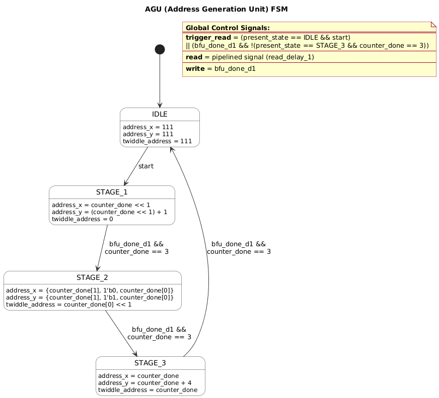
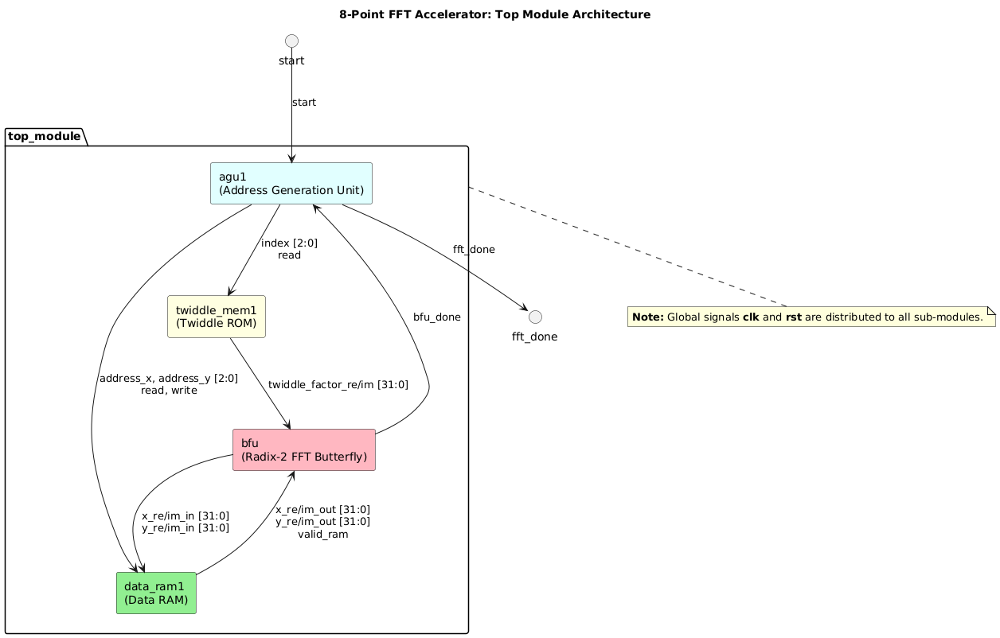

# 8-Point FFT Module (Parallel and Serial Pipelined Architectures)

This repository contains an implementation of an **8-point FFT module** in:
- **Serial pipelined architecture**
- **Parallel pipelined architecture**

## Overview

The design is organized around a top-level control path and a pipelined butterfly datapath.

- `top_module.v` connects the address generation unit, twiddle ROM, data RAM, and radix-2 butterfly.
- `agu.v` is the main control FSM that sequences the 8-point FFT through three stages.
- `radix2_fft.v` performs the complex butterfly arithmetic using floating-point adders and multipliers.
- `data_ram.v` stores the complex input samples and updated FFT results.
- `twiddle_memory.v` provides the twiddle factors used by each stage.
- The FloPoCo-generated VHDL files implement the floating-point converters, adder, and multiplier blocks.

## Architecture Diagrams

### AGU FSM

The address generation unit uses a small finite state machine to step through the FFT stages.

### Top Module Architecture

The top module wires the control FSM, data memory, twiddle ROM, and butterfly pipeline together.

## Module Notes

### `agu.v`

This module generates `read`, `write`, `valid_in`, memory addresses, and the `fft_done` flag. The state flow is:

- `IDLE` waits for `start`
- `STAGE_1` processes the first butterfly group
- `STAGE_2` processes the second butterfly group
- `STAGE_3` processes the final butterfly group and returns to `IDLE`

### `data_ram.v`

This is a small 8-word complex memory for the real and imaginary parts. It supports synchronous reads and writes controlled by the AGU and butterfly pipeline.

### `twiddle_memory.v`

This ROM supplies twiddle factors for each stage of the 8-point FFT.

### `radix2_fft.v`

This is the butterfly datapath. It multiplies the `B` input by the twiddle factor, then adds/subtracts the result from `A` to produce `X` and `Y` outputs. The design uses a valid pipeline and asserts `done` when the pipeline output is ready.

### FloPoCo blocks

The repository includes generated VHDL for floating-point conversion and arithmetic:

- `Input_Converter.vhdl`
- `Output_Converter.vhdl`
- `ZedMult.vhdl`
- `flopoco.vhdl`

These blocks are used by `fp_multiplier.v` and the butterfly arithmetic path.

## Data Flow

1. `start` is asserted at the top level.
2. `agu.v` selects memory addresses and twiddle indices for the current FFT stage.
3. `data_ram.v` reads a complex pair from memory.
4. `twiddle_memory.v` provides the matching twiddle factor.
5. `radix2_fft.v` computes the butterfly result.
6. The updated values are written back into `data_ram.v`.
7. `fft_done` is asserted once all three stages complete.

## Simulation Files

The `sims/` directory contains testbench files for individual blocks and top-level integration.

## Notes

The VHDL sources rely on generated FloPoCo modules, so simulation/synthesis must include those files in the compile order.

The memory initialization files referenced by the RAM and ROM modules should be present when running simulations.

## Acknowledgment: FloPoCo Adder and Multiplier Modules

This project uses **FloPoCo-generated arithmetic modules**, including adder and multiplier components.

**FloPoCo is open-source, and contributions are welcome.**

FloPoCo is distributed under the **FloPoCo license**. It is a modified AGPL, so that the code generated by FloPoCo is itself available under **LGPL**.

## Notes

Please refer to the FloPoCo project and license terms for full details on usage and redistribution.
