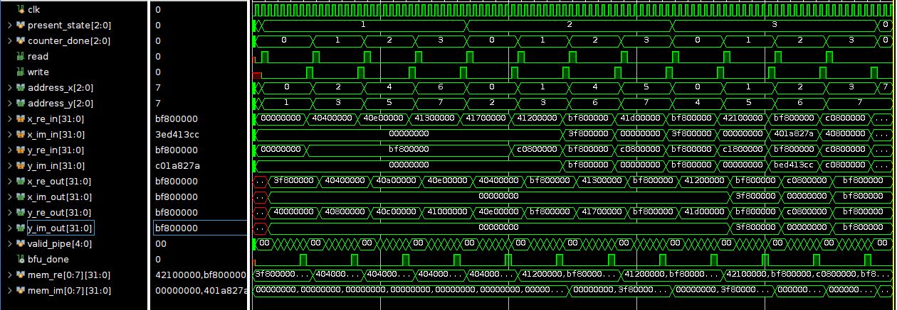

# IEEE-754 Floating-Point FFT Accelerator

### FSM-Controlled 8-Point Radix-2 Cooley-Tukey FFT Architecture in Verilog

<p align="center">
  
</p>

<p align="center">
  
  
  
  
</p>

---

## Overview

This project implements an IEEE-754 floating-point 8-point Fast Fourier Transform (FFT) accelerator in Verilog using the radix-2 Cooley-Tukey decomposition algorithm.

Unlike a standalone butterfly implementation, this design includes a complete hardware execution framework consisting of:

* FSM-Based Address Generation Unit (AGU)
* Data RAM for intermediate storage
* Twiddle Factor ROM
* Radix-2 Butterfly Unit (BFU)
* FloPoCo-generated floating-point arithmetic units

The AGU serves as the control plane of the accelerator, orchestrating butterfly scheduling, memory accesses, twiddle-factor selection, and stage transitions across all FFT stages.

---

## Key Features

* IEEE-754 Single Precision Floating-Point Arithmetic
* Radix-2 Cooley-Tukey FFT Algorithm
* FSM-Based Address Generation Unit
* Shared Butterfly Computation Engine
* Memory-Based FFT Scheduling
* Modular Verilog RTL Design
* FloPoCo Floating-Point Arithmetic Integration
* Complete Simulation and Verification Environment

---

## Architecture Overview

<p align="center">
  
</p>

The accelerator is composed of four major subsystems:

### Address Generation Unit (AGU)

The AGU is responsible for:

* FFT stage sequencing
* Memory address generation
* Twiddle-factor index selection
* Read/write control generation
* FFT completion signaling

### Data RAM

Stores:

* Input samples
* Intermediate FFT values
* Final FFT outputs

### Twiddle ROM

Provides precomputed twiddle coefficients required during FFT computation.

### Butterfly Unit (BFU)

The BFU performs radix-2 butterfly operations using IEEE-754 floating-point arithmetic.

For inputs A and B:

```math
X = A + BW
```

```math
Y = A - BW
```

where W represents the selected twiddle factor.

---

## AGU Finite State Machine

<p align="center">
  
</p>

The AGU controls FFT execution through three FFT stages.

| State   | Function                     |
| ------- | ---------------------------- |
| IDLE    | Wait for start signal        |
| STAGE_1 | First butterfly stage        |
| STAGE_2 | Intermediate butterfly stage |
| STAGE_3 | Final butterfly stage        |
| DONE    | Assert fft_done              |

The FSM generates memory addresses and twiddle-factor indices required for each butterfly computation.

---

## Data Flow

1. `start` initiates FFT execution.
2. AGU generates operand addresses and twiddle indices.
3. Data RAM supplies complex operands.
4. Twiddle ROM provides FFT coefficients.
5. BFU performs radix-2 butterfly computation.
6. Results are written back into RAM.
7. AGU advances to the next FFT stage.
8. `fft_done` is asserted after Stage 3 completion.

---

## Verification Methodology

The design was verified through module-level and system-level simulation.

Verification includes:

* AGU functional verification
* Butterfly datapath verification
* Memory subsystem verification
* Full FFT integration testing

### Simulation Waveform

<p align="center">
  
</p>

The waveform demonstrates:

* Stage transitions
* Memory read/write operations
* Butterfly completion events
* FFT completion signaling

---

## Results

| Metric               | Value                       |
| -------------------- | --------------------------- |
| FFT Size             | 8 Point                     |
| Algorithm            | Radix-2 Cooley-Tukey        |
| Precision            | IEEE-754 Single Precision   |
| FFT Stages           | 3                           |
| Butterfly Operations | 12                          |
| Architecture         | Memory-Based FFT Scheduling |

### Future Synthesis Metrics

| Metric            | Value |
| ----------------- | ----- |
| LUT Utilization   | TBD   |
| Flip-Flops        | TBD   |
| DSP Blocks        | TBD   |
| BRAM Usage        | TBD   |
| Maximum Frequency | TBD   |
| Total Latency     | TBD   |

---

## Design Tradeoffs

| Design Choice             | Motivation                            |
| ------------------------- | ------------------------------------- |
| Shared Butterfly Engine   | Reduced hardware utilization          |
| FSM-Based Scheduling      | Simplified control path               |
| Floating-Point Arithmetic | Improved numerical accuracy           |
| Memory-Based Execution    | Flexible staged FFT processing        |
| 8-Point FFT               | Baseline architecture for scalability |

---

## Repository Structure

```text
.
├── srcs/
│   ├── top_module.v
│   ├── agu.v
│   ├── radix2_fft.v
│   ├── data_ram.v
│   └── twiddle_memory.v
│   ├── Input_Converter.vhdl
│   ├── Output_Converter.vhdl
│   ├── ZedMult.vhdl
│   └── flopoco.vhdl
│
├── sims/
│   ├── tb_fft.v
│   └── tb_top_module.v
│
├── pictures/
│   ├── sequence.png
│   ├── AGU_FSM.png
│   └── Simulation.png
│
│
└── README.md
```

---

## Future Work

* Parameterizable FFT Sizes (16, 32, 64 Point)
* Streaming FFT Architecture
* Chisel-Based Reimplementation
* Posit Arithmetic Support
* AXI4 Interface Integration
* FPGA Resource Optimization
* AI Accelerator Integration (Gemmini-like Architectures)

---

## Acknowledgements

This project utilizes floating-point arithmetic units generated using FloPoCo.

FloPoCo is an open-source arithmetic core generator. Generated arithmetic modules are included in accordance with FloPoCo licensing terms.

For more information:

https://flopoco.org

---

## Author

**Bala Phanikar Challa**
